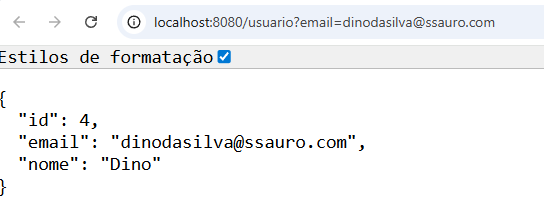

# crud-spring-boot-2025-2
crud-spring-boot-2025 2a Vez


# CRUD Java com Spring Boot 2025 | Aprenda o Projeto QUE TODO DEV PRECISA TER no Portfólio!

Inspirado no video do canal [javanauta](https://www.youtube.com/@javanauta)

[CRUD Java com Spring Boot 2025 | Aprenda o Projeto QUE TODO DEV PRECISA TER no Portfólio!](https://www.youtube.com/watch?v=yW7RrWfUeHE&list=PLVH4zxtGfwkPZfp2TGTI7yF0erKGBXozX)

Vamos construir um CRUD completo com Java e Spring Boot em 2025, usando as novidades da JDK 23.

## String initializr

https://start.spring.io/


## Rodar projeto no WSL

wendel@Wendel:~/cursosSpring/crud-spring-boot-2025-2$ ```chmod +x mvnw```
wendel@Wendel:~/cursosSpring/crud-spring-boot-2025-2$ ```mvn spring-boot:run```
[INFO] Scanning for projects...
[INFO]
[INFO] ----------------< dev.wfrsilva:crud-spring-boot-2025-2 >----------------
[INFO] Building crud-spring-boot-2025-2 0.0.1-SNAPSHOT
[INFO] --------------------------------[ jar ]---------------------------------

(...)

[INFO] ------------------------------------------------------------------------
[INFO] BUILD FAILURE
[INFO] ------------------------------------------------------------------------

(...)

 ### ERRO : version 24 not supported

[ERROR] Failed to execute goal org.apache.maven.plugins:maven-compiler-plugin:3.14.0:compile (default-compile) on project crud-spring-boot-2025-2: Fatal error compiling: error: release version 24 not supported -> [Help 1]
[ERROR]
[ERROR] To see the full stack trace of the errors, re-run Maven with the -e switch.
[ERROR] Re-run Maven using the -X switch to enable full debug logging.
[ERROR]


Isso significa que o teu projeto está configurado para usar Java 24 
(no pom.xml tem **<java.version>24</java.version>** ), mas no WSL você não tem o **JDK 24** instalado.

### SOLUÇÃO : Ajustar o projeto para usar Java 21 (LTS) ou 17 (LTS)
Para nao precisar atualziar o WSL no momento para java 24, mais facil reconfigurar o projeto para java **17** - tentado java 21 e WSL ainda nao aceitou.

Editar o pom.xml e trocar:

<pre>
<properties>
    <java.version>17</java.version>
</properties>
</pre>


## Mudança na forma de passar parâmetros nas requisições

### Endpoints atualizados para usar **path variables**, permitindo acessar usuários por **id** ou **email** nos métodos **GET**, **PUT** e **DELETE**.

No projeto anterior, os endpoints usavam **query parameters** para identificar usuários:
´´´
GET http://localhost:8080/usuario?id=1

GET http://localhost:8080/usuario?email=codorna@coturnix.com
´´´
Agora, os endpoints foram alterados para usar **path variables**, permitindo acessar usuários por **email** ou **id** nos métodos **GET**, **PUT** e **DELETE**.
´´´
GET http://localhost:8080/usuario/id/1

GET http://localhost:8080/usuario/email/codorna@coturnix.com
´´´
## Alterações no controller

- Os métodos **GET, PUT e DELETE** agora recebem `id` ou `email` como **@PathVariable** em vez de **@RequestParam**.
- Exemplo de mapeamento atualizado:

```java
// Buscar usuário por ID
@GetMapping("/id/{id}")
public ResponseEntity<Usuario> buscarUsuarioPorId(@PathVariable Integer id)

// Buscar usuário por email
@GetMapping("/email/{email}")
public ResponseEntity<Usuario> buscarUsuarioPorEmail(@PathVariable String email)

// Atualizar usuário por ID
@PutMapping("/id/{id}")
public ResponseEntity<Void> atualizarUsuarioPorId(@PathVariable Integer id, @RequestBody Usuario usuario)

// Atualizar usuário por email
@PutMapping("/email/{email}")
public ResponseEntity<Void> atualizarUsuarioPorEmail(@PathVariable String email, @RequestBody Usuario usuario)

// Deletar usuário por ID
@DeleteMapping("/id/{id}")
public ResponseEntity<Void> deletarUsuarioPorId(@PathVariable Integer id)

// Deletar usuário por email
@DeleteMapping("/email/{email}")
public ResponseEntity<Void> deletarUsuarioPorEmail(@PathVariable String email)
```


## DeleteBy - colocado duas rotas: ID e EMAIL

Como temos duas formas de delete: uma por ```id``` e outra por ```email```, precisamos separar as rotas para evitar conflito.

### @DeleteMapping("/usuario/id/{id}")
```
    @DeleteMapping("/usuario/id/{id}")
    public ResponseEntity<Void> deletarUsuarioPorId(@RequestParam Integer id){
        usuarioService.deletarUsuarioPorId(id);
        return ResponseEntity.ok().build();
    }//deletarUsuarioPorId

```

### @DeleteMapping("/usuario/email/{email}")
```
    @DeleteMapping("/usuario/email/{email}")
    public ResponseEntity<Void> deletarUsuarioPorEmail(@RequestParam String email){
        usuarioService.deletarUsuarioPorEmail(email);
        return ResponseEntity.ok().build();
    }//deletarUsuarioPorEmail
```

## Arquivos .http (postman)

Os arquivos `.http` são uma  alternativa ao Postman.

### .http - Como executar?

#### VS Code:
- Instale a extensão: REST Client (por Huachao Mao).

- Salve o arquivo como `.http` ou `.rest`.

- Clique em "Send Request" logo acima da requisição.


## H2-Console

Esta configurado no `application.properties`:

```
 # H2 Console
spring.h2.console.enabled=true
spring.h2.console.path=/h2-console 
```

### H2 url

[http://localhost:8080/h2-console/](http://localhost:8080/h2-console/)


### GET url

http://localhost:8080/usuario?email=dinodasilva@ssauro.com

